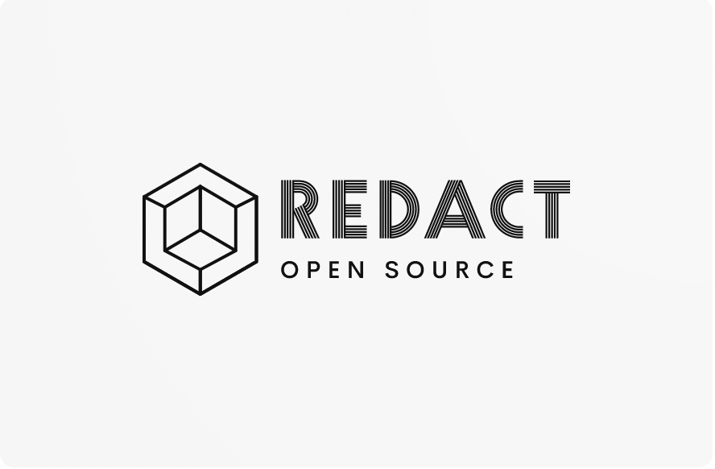

# Modular blog



## About Redact

Redact is built with php and laravel. Redact is a place to write articles. Redact is suitable for developers who want to
learn more about Laravel and know how to use technologies.

* [Installation](#installation)
    * [Docker](#docker)
    * [Without Docker](#without-docker)

* [Technology](#usage)
    * [Horizon](#horizon)
    * [Kibana](#kibana)

## Installation

If you have docker,set up with it:

### Docker

```sh
git clone https://github.com/idanieldrew/redact

cd modular-blog

# set environment
copy .env.example .env

# Start docker in os
docker-compose up --build
```

### Without Docker

```sh
git clone https://github.com/idanieldrew/redact

cd modular-blog

# set environment
copy .env.example .env

# install composer
composer install
```

## Technology

### Horizon

In docker-compose,I used RabbitMQ for queue driver for laravel,if you want use redis,pay attention environment.
First,Running horizon

```
php artisan horizon
```

and then open this url:

```
http://127.0.0.1/horizon/dashboard
```

### Kibana

In Kibana,I stored data and also stored logs with Filebeat and then transform with elastic

```
http://localhost:5601
```

and then create dashboards and also run queue driver for transform post model to elastic.

```
php artisan queue:work //Pay attension queue driver
```

## Tests

```
docker-compose exec redact_application php artisan test
```

## Fake data

```sh
docker-compose exec weblog_application php artisan migrate:fresh --seed
```

## Database Description

#### Laravel is flexible in determining database but i performed

- PostgresQL for main database
- Redis for cache database
- Elasticsearch for search posts(blogs)

## Webserver Description

- Nginx,because use php-fpm

## Other Description

- Use Kibana for dashboard and management elastic
- Has continuous integration(GitHub actions)

## Tips for developers

- This project is modular,therefor it's content in "Modules" folder
- I tried to ensure all services or modules have tests and their coverage is close to 100%,but you can also help to
  increase coverage tests
- For language and translatable,I make a custom module(Lang).I got help
  form [spatie package](https://github.com/spatie/laravel-translatable).this package gives you many possibilities,but i
  don't need all this.That's why i made this module.
- Similarly, For Roles & permissions,I make a custom module(Role).I got help
  form [spatie package](https://github.com/spatie/laravel-permission). This package gives you many possibilities,but i
  don't need all this.That's why i made this module.
- Use cache for queries(redis)
- I tried to clean code so use Solid and Design patterns. If you have an idea to make the code cleaner,do a pull
  request.

## Pull Requests

Thank you for investing your time in contributing to our project.


